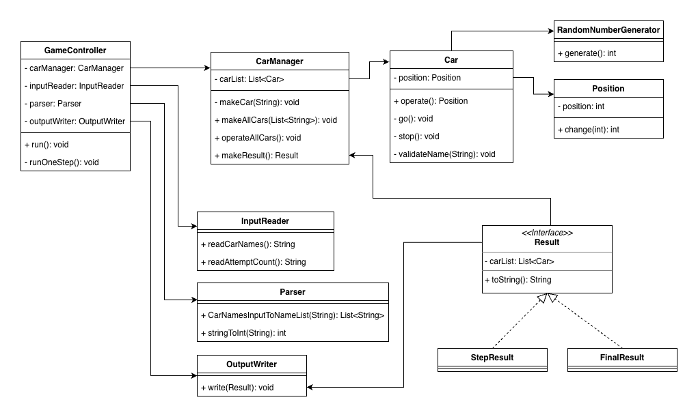

# 자동차 경주
입력된 자동차끼리 경주하여 그 결과를 출력한다.

# 기능 요구 사항
초간단 자동차 경주 게임을 구현한다.

- 주어진 횟수 동안 n대의 자동차는 전진 또는 멈출 수 있다.
- 각 자동차에 이름을 부여할 수 있다. 전진하는 자동차를 출력할 때 자동차 이름을 같이 출력한다.
- 자동차 이름은 쉼표(,)를 기준으로 구분하며 이름은 5자 이하만 가능하다.
- 사용자는 몇 번의 이동을 할 것인지를 입력할 수 있어야 한다.
- 전진하는 조건은 0에서 9 사이에서 무작위 값을 구한 후 무작위 값이 4 이상일 경우이다.
- 자동차 경주 게임을 완료한 후 누가 우승했는지를 알려준다. 우승자는 한 명 이상일 수 있다.
- 우승자가 여러 명일 경우 쉼표(,)를 이용하여 구분한다.
- 사용자가 잘못된 값을 입력할 경우 IllegalArgumentException을 발생시킨 후 애플리케이션은 종료되어야 한다.

# 입출력 요구 사항
## 입력
- 경주할 자동차 이름(이름은 쉼표(,) 기준으로 구분)
- 시도할 횟수
## 출력
- 차수별 실행 결과
- 단독 우승자 안내 문구
- 공동 우승자 안내 문구
## 예시
```text
경주할 자동차 이름을 입력하세요.(이름은 쉼표(,) 기준으로 구분)
pobi,woni,jun
시도할 횟수는 몇 회인가요?
5

실행 결과
pobi : -
woni : 
jun : -

pobi : --
woni : -
jun : --

pobi : ---
woni : --
jun : ---

pobi : ----
woni : ---
jun : ----

pobi : -----
woni : ----
jun : -----

최종 우승자 : pobi, jun
```

# 구현할 기능
## GameController
- [x] 게임 전체 로직
## RandomNumberGenerator
- [x] 무작위 값 생성
## Car
- [ ] 자동차 이름 검증(5글자 이하)
- [x] 무작위 값에 의한 동작
  - [x] 전진
  - [x] 정지
## CarManager
- [x] 자동차 객체 생성, 저장
- [x] 자동차 동작 메서드 호출
- [x] 라운드 상태 반환
## Position
- [x] 위치 값 저장, 변경, 반환
## Result
- 결과 인터페이스
### StepResult
- [x] toString 재구현
### FinalResult
- [x] toString 재구현
## InputReader
- [x] 자동차 이름 입력
- [x] 시도 횟수 입력
## OutputWriter
- [x] 차수별 실행 결과 출력
- [x] 우승자 안내 문구 출력
## Parser
- [x] 자동차 이름 입력을 이름 리스트로 변환
- [x] 시도 횟수 입력을 정수로 변환

# 클래스 다이어그램


# 학습 목표
- 여러 역할을 수행하는 큰 함수를 단일 역할을 수행하는 작은 함수로 분리한다.
- 테스트 도구를 사용하는 방법을 배우고 프로그램이 제대로 작동하는지 테스트한다.
## 구체적 목표
- [x] 디버거 사용
- [ ] 다양한 테스트 케이스 작성
- [x] 리드미 구체적으로 작성, 클래스다이어그램 작성
- [ ] 제네릭 사용
- [ ] 인터페이스 사용
- [x] 에러메시지를 enum으로 구현
- [ ] 테스트 코드에서 ParameterizedTest, ValueSource 사용
